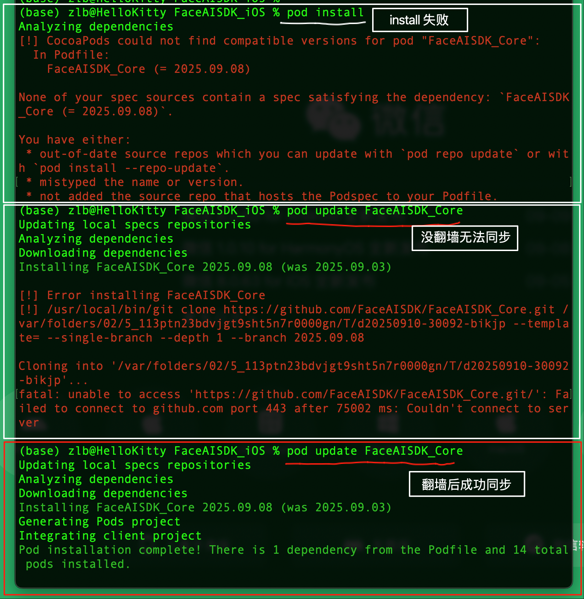

 

## FaceAISDK 介绍
iOS FaceAISDK is on_device Offline Face Detection 、Recognition 、Liveness Detection Anti Spoofing SDK.  
FaceAISDK是iOS 设备端可离线不需联网的人脸录入、动作活体检测、人脸识别SDK，集成后可快速实现相关功能。  

  
.  

## 集成步骤

**SDK默认的开发环境为Xcode 16.3 ,Swift 6.1，OC&C；UI全部使用SwiftUI实现，支持iOS[16,26]**

先跑成功本Demo，你的开发电脑需要能科学上网翻墙，部分资源托管在GitHub，否则无法运行成功

  

#### 0. 安装Demo运行的ToastUI 依赖库
Navigate to your project settings. Find a new tab called “Package Dependencies”. 
Click the “+” button to open the add package dialog. 
Installation ToastUI https://github.com/quanshousio/ToastUI 

#### 1.Podfile 添加依赖
  最新版本一般会在本工程Podfile 中指定，请复制指定版本到你的项目  
  首次依赖本SDK到你的主项目大约耗费15-30分钟左右时间（实际取决于你的网络状态）  
  **pod update FaceAISDK_Core 安装依赖,请指定版本**

  pod 'FaceAISDK_Core', 'Newest Version'  

#### 2. 拷贝FaceAINaviView,AddFaceView,VerifyFaceView 到你的工程  
  记得声明相机使用权限；应用内跳转到 FaceAINaviView功能演示导航页面你就可以开始体验效果  
  
#### 3. 根据你的业务需求修改View 和参数设置等定制你的应用  
  SDK中人脸录入和识别都需要指定一个唯一的FaceID Key来关联你的用户，可以使用注册的手机号等唯一ID
  动作活体检测可以指定动作活体的步骤个数为1还是2个；其中SDK 的UI实现是完整暴露给开发者自由修改  
  

## 其他说明 
  本SDK 需要摄像头实时获取预览数据，目前只支持真机调试。
  
  微信：FaceAISDK  
  Email: FaceAISDK.Service@gmail.com   
  Android： https://github.com/FaceAISDK/FaceAISDK_Android
     
  
## Android体验Demo APK下载如下  
  

  

.  

