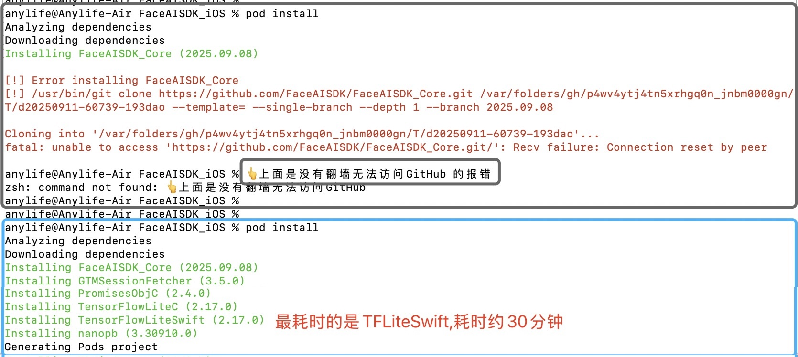

 

## FaceAISDK 介绍
iOS FaceAISDK is on_device Offline Face Detection 、Recognition 、Liveness Detection Anti Spoofing SDK.  
FaceAISDK是iOS 设备端可离线不需联网的人脸录入、动作活体检测、人脸识别SDK，集成后可快速实现相关功能。  

## 集成步骤

SDK默认的开发环境为Xcode 16.2 ,Swift 6.0，OC&C；UI全部使用SwiftUI实现，支持iOS[16,26]

**跑成功本Demo，你的开发电脑需要能科学上网翻墙，部分资源托管在GitHub，否则无法运行成功**

### 0. 使用git Clone 本Demo仓库代码
你可以使用命令 git clone https://github.com/FaceAISDK/FaceAISDK_iOS.git
然后点击白色图标「FaceAISDK_iOS.xcworkspace」 打开项目

### 1. 确认电脑能科学上网翻墙后，使用Pod命令安装FaceAISDK和相关依赖库
一般pod install 命令能完整的下载同步安装好所有依赖，也可以pod update FaceAISDK_Core仅更新人脸识别SDK
不同开发设备和网络环境，首次集成到主项目依赖同步**耗时30分钟左右**，建议此时去喝杯水活动一下颈椎😭
Installing TensorFlowLiteSwift (2.17.0) 这是最耗时的基础依赖安装

### 2. 安装Demo运行的ToastUI 依赖库
Navigate to your project settings. Find a new tab called “Package Dependencies”. 
Click the “+” button to open the add package dialog. 
Installation ToastUI 参考 https://github.com/quanshousio/ToastUI to Pod.

  

### 3. 最后一步骤别忘了
 升级版本最后执行 pod update FaceAISDK_Core 后clean all Issues，否则出错（不太清楚原因）  
   pod update FaceAISDK_Core
 Swift/Integers.swift:3564: Fatal error: Not enough bits to represent the passed value
**经过漫长的等待，编译完成后✅ 就可以在手机体验效果了**

## 其他说明 
  本SDK 需要摄像头实时获取预览数据，目前只支持真机调试。
  
  微信：FaceAISDK  
  Email: FaceAISDK.Service@gmail.com   
  Android： https://github.com/FaceAISDK/FaceAISDK_Android
     
  
## Android体验Demo APK下载如下  
  

  

.  

